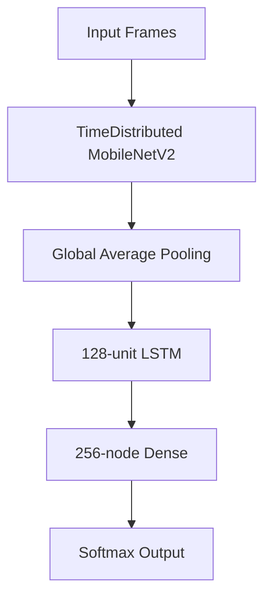

# Human Activity Recognition using LSTM-CNN 🤖📹


This project implements a human activity recognition system using a hybrid LSTM-CNN architecture trained on the UCF101 dataset. The model extracts spatial features using CNN (MobileNetV2) and then processes the temporal sequence using LSTM layer.

## 📚 Dataset Deep Dive

To build this project, one can use one of two popular datasets:
1 - Kinetics (Kinetics Human Action Video Dataset)
2 - UCF101 (UCF101 Human Actions dataset)

### Comparative Analysis: UCF101 vs. Kinetics
| **Criterion**               | **UCF101**                          | **Kinetics**                     |
|-----------------------------|-------------------------------------|----------------------------------|
| **Number of Classes**       | 101 classes (e.g., jumping, dancing)| 400–700 classes (e.g., playing instruments, group interactions) |
| **Number of Videos**        | ~13,320 videos                     | ~650,000 videos (in k700 version)|
| **Video Duration**          | Variable (seconds to minutes)      | ~10 seconds                      |
| **Data Source**             | YouTube (manually curated)         | YouTube (automatically scraped URLs) |
| **Format**                  | Direct video files                 | URLs (requires manual download)  |
| **Diversity**               | Uncontrolled conditions (lighting, backgrounds)| Complex interactions (e.g., playing with others) |
| **Research Use Cases**      | Your CNN-LSTM (e.g., simple action recognition)| Deep models (e.g., 3D ResNet)   |
| **Preprocessing**           | Pre-split train/test sets          | No optimized splits               |
| **LSTM Suitability**        | Short videos → fits limited memory | Short videos → suitable, but large dataset |

That is lead you to conclusion that if you want to build a **CNN-LSTM** from scratch, **UCF101** is ideal because:  
1. **Ease**: Directly downloadable videos.  
2. **Realism**: Uncontrolled conditions mimic real-world scenarios.  
3. **LSTM Compatibility**: Short videos align with LSTM’s memory constraints.


**UCF101** is a dataset of realistic action videos collected from YouTube, consisting of `101` action categories. This project uses the pre-processed **UCF101 Frames dataset** from Kaggle, which contains video frames extracted from the original videos.


Although the original database is available on Kaggle [`UCF101 Videos`](https://www.kaggle.com/datasets/pevogam/ucf101), I chose this database [`UCF101 Frames`](https://www.kaggle.com/datasets/pevogam/ucf101-frames/) because it will save me the frame extraction step.

### 🎥 **Extracted Frames vs. Full Videos in CNN-LSTM Training**  

|    **Aspect**         | 🖼️ **Extracted Frames** | 🎞️ **Full Videos** |
|----------------------|----------------------|-------------------|
| ⚙️ **Preprocessing** | Ready to use, no need for frame extraction. | Requires frame extraction using OpenCV or FFmpeg. |
| 🎯 **Frame Rate**    | Fixed (e.g., 25fps), cannot be changed later. | Flexible, can be adjusted during training. |
| 💾 **Storage**       | Large (e.g., 100GB for UCF101). | Compressed and smaller (e.g., 6.5GB for UCF101). |
| 🚀 **Loading Speed** | Faster, as frames are pre-extracted. | Slower, due to frame extraction during training. |
| 🔄 **Model Flexibility** | May lose motion details. | Full control over frame rate for better performance. |

If you want to take a look at the Python scripts that extracted the frames, here's a link to [Matt Harvey's tutorial](https://blog.coast.ai/five-video-classification-methods-implemented-in-keras-and-tensorflow-99cad29cc0b5) and [Matt Harvey's repository](https://github.com/Tanny1810/Human-Activity-Recognition-LSTM-CNN/tree/main) .

## **Challenges in This Project – A Battle Against Memory Constraints😭**  

#### **🔥 1. High Memory Consumption (Memory Allocation Issue)**  

Training this model on Kaggle was nothing short of a nightmare. The dreaded error **"Your notebook tried to allocate more memory than is available"** didn’t just appear once or twice—it haunted me over **20 times**. Each time, I had to rethink, tweak, and compromise just to keep the project alive. I tried **everything** to avoid this overflow, but each solution came with a cost:  

- 🔹 **Reducing the batch size:** Started with 20, then 10, then 4—each reduction slowed training down significantly.  
- 🔹 **Shrinking image dimensions (IMG_SIZE):** Cut down from **320×240** to **224×224**, and finally to **160×160**—but at what cost? Loss of image quality.  
- 🔹 **Reducing the number of frames (NUM_FRAMES):** Ideally, 100 frames per video would capture sufficient motion, but I was forced to drop it to **16, then 8**—losing valuable temporal information.  
- 🔹 **Extracting fewer sequences per class:** Went from **10 down to 5** sequences per class, further limiting data representation.  
- 🔹 **Switching to MobileNetV2:** I **completely abandoned** my original model and even **ResNet50**, resorting to **MobileNetV2** just to survive within memory constraints.  
- 🔹 **Freezing CNN layers:** Froze **100+ layers**, reducing trainable parameters and, consequently, the model’s learning capacity.  
- 🔹 **Using GlobalAveragePooling2D:** To cut down dimensionality before passing to LSTM layers, mitigating some memory issues.  
- 🔹 **Reducing LSTM units:** Lowered from **256 to 128**, simplifying the model but again, at the expense of learning power.  

Every single tweak was a **sacrifice**—either in accuracy, training speed, or model complexity. But I had two choices:  
1. **Push through and get a functional model, even if it wasn’t perfect.**  
2. **Give up after countless days of struggle.** (Which was **never** an option.)  

At this point, I had **other ideas** for optimization, but time was merciless. With a **strict deadline**, I simply didn’t have the luxury to experiment further.  

#### **📌 2. Dataset Struggles – A Structural Nightmare**  

The dataset itself? **A complete mess.** It wasn’t just frames extracted from videos—it was frames dumped **randomly** into category folders **without any indication of which frames belonged to the same video**.  

This meant that I had to **design an entire mechanism** to reconstruct video sequences from scattered images. **Manually** grouping frames into coherent sequences to mimic video movements was an absolute headache.  

🔹 **Data Leakage Issue:** Using `train_test_split` randomly **risked splitting frames from the same video** into both training and validation sets, causing **information leakage** and an **overestimated model accuracy**.  
🚨 **Solution?** We abandoned splitting `train` entirely and used the `test` folder for validation, ensuring that sequences from the same video **stayed together**.  

🔹 **Inconsistent Frame Counts Per Class:** Some classes had **as few as 29 frames**, while others had **over 1,700**. This made setting a **fixed SEQUENCE_LENGTH** incredibly tricky—**too small, and we lost crucial information; too large, and memory issues returned with a vengeance.**  

## 🏗️ Architectural Breakdown

The model uses a two-stage approach:
1. **CNN Feature Extraction**: Uses MobileNetV2 pre-trained extract spatial features from each frame
2. **Temporal Processing**: LSTM layer to capture the temporal dynamics across the sequence of frames

### Hybrid Model Design


### Optimized Model Code
```python
def build_optimized_model():
    # Lightweight MobileNetV2 base
    base_cnn = MobileNetV2(weights='imagenet', include_top=False,
                          input_shape=(224, 224, 3))
    
    # Strategic layer freezing
    for layer in base_cnn.layers[:100]:
        layer.trainable = False
    
    # Feature extraction pipeline
    feature_extractor = Sequential([
        base_cnn,
        GlobalAveragePooling2D()  # Dimensionality reduction
    ])
    
    # Temporal modeling
    model = Sequential([
        TimeDistributed(feature_extractor, input_shape=(16, 224, 224, 3)),
        LSTM(128),  # Balanced capacity/memory
        Dense(256, activation='relu'),
        Dropout(0.5),
        Dense(101, activation='softmax')
    ])
    
    model.compile(optimizer=Adam(0.0001), 
                loss='categorical_crossentropy',
                metrics=['accuracy'])
    return model
```


## 🙌 Acknowledgments

- **Dataset**: [UCF101](https://www.kaggle.com/datasets/pevogam/ucf101-frames/)و  [UCF101](https://paperswithcode.com/dataset/ucf101)
- **Matt Harvey**: Matt Harvey's article [Five video classification methods implemented in Keras and TensorFlow](https://blog.coast.ai/five-video-classification-methods-implemented-in-keras-and-tensorflow-99cad29cc0b5), [Matt Harvey's Repository](https://github.com/harvitronix/five-video-classification-methods?tab=readme-ov-file)


## 💬 Contact

For technical discussions or collaboration opportunities:  
📧 [email](arwaabouattia@gmail.com)  
💼 [LinkedIn Profile](https://www.linkedin.com/in/arwa-abou-attia-87312a22b/)
